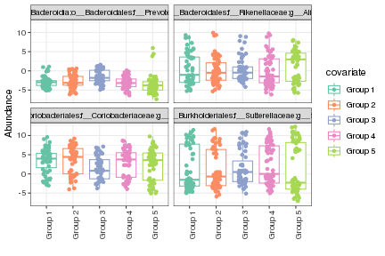
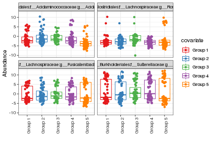
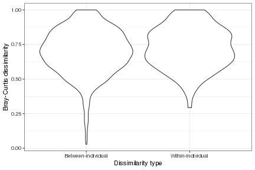
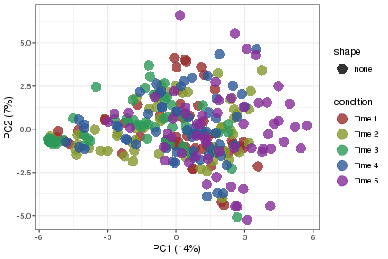
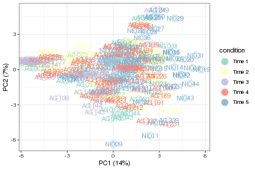
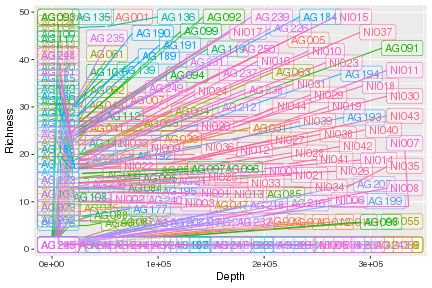
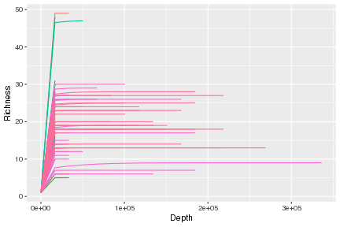

```r
library(OCMSutility)
#> Warning: replacing previous import 'dplyr::rename' by
#> 'reshape::rename' when loading 'OCMSutility'
library(ggplot2)
library(dplyr)
#> 
#> Attaching package: 'dplyr'
#> The following objects are masked from 'package:stats':
#> 
#>     filter, lag
#> The following objects are masked from 'package:base':
#> 
#>     intersect, setdiff, setequal, union
```

```
#> Warning in readChar(con, 5L, useBytes = TRUE): cannot open
#> compressed file '/home/syen/../data/asv_example.RData', probable
#> reason 'No such file or directory'
#> Error in readChar(con, 5L, useBytes = TRUE): cannot open the connection
```
# Overview

This package was created by members of the Oxford Centre for Microbiome Studies (OCMS). It is a collection of functions that we have found useful and hope that they are useful to others. The functions span data manipulation, statistical analysis and data visualisation, predominantly for microbiome data. Functions in this package and use cases are documented below.

## example data

An example 16S dataset is included in the package. You can load this with `data(asv_example)`


```r
data(asv_example)

# 49 ASVs and 296 samples
dim(asv_example)
#> [1]  49 296

# taxonomy table
dim(tax_example)
#> [1] 49  7
head(tax_example)
#>                                                                                                                                 sequence
#> 1 ASV1:p__Firmicutes;c__Negativicutes;o__Selenomonadales;f__Acidaminococcaceae;g__Acidaminococcus;s__Acidaminococcus_intestini(AF473835)
#> 2                                            ASV2:p__Bacteroidetes;c__Bacteroidia;o__Bacteroidales;f__Prevotellaceae;g__Prevotella;s__NA
#> 3                  ASV3:p__Firmicutes;c__Negativicutes;o__Selenomonadales;f__Veillonellaceae;g__Dialister;s__Dialister_invisus(AY162469)
#> 4                                            ASV4:p__Bacteroidetes;c__Bacteroidia;o__Bacteroidales;f__Prevotellaceae;g__Prevotella;s__NA
#> 5                                  ASV5:p__Proteobacteria;c__Betaproteobacteria;o__Burkholderiales;f__Sutterellaceae;g__Sutterella;s__NA
#> 6                                         ASV6:p__Firmicutes;c__Clostridia;o__Clostridiales;f__Lachnospiraceae;g__Clostridium XlVa;s__NA
#>           Phylum              Class           Order
#> 1     Firmicutes      Negativicutes Selenomonadales
#> 2  Bacteroidetes        Bacteroidia   Bacteroidales
#> 3     Firmicutes      Negativicutes Selenomonadales
#> 4  Bacteroidetes        Bacteroidia   Bacteroidales
#> 5 Proteobacteria Betaproteobacteria Burkholderiales
#> 6     Firmicutes         Clostridia   Clostridiales
#>               Family            Genus
#> 1 Acidaminococcaceae  Acidaminococcus
#> 2     Prevotellaceae       Prevotella
#> 3    Veillonellaceae        Dialister
#> 4     Prevotellaceae       Prevotella
#> 5     Sutterellaceae       Sutterella
#> 6    Lachnospiraceae Clostridium XlVa
#>                               Species
#> 1 Acidaminococcus_intestini(AF473835)
#> 2                                <NA>
#> 3         Dialister_invisus(AY162469)
#> 4                                <NA>
#> 5                                <NA>
#> 6                                <NA>
```

## ocms_clr

ocms_clr uses the [ALDEx2](https://www.bioconductor.org/packages/release/bioc/html/ALDEx2.html) package to perform centred log-ratio transformation on a count matrix from for example 16S rRNA profiling.  

Usage:


```r
# rownames have to be features
asv_counts <- data.frame(asv_example[2:ncol(asv_example)], row.names=asv_example$sequence)

clr_transformed <- ocms_clr(count_dataframe = asv_counts, return_as_dataframe = TRUE)
#> multicore environment is is OK -- using the BiocParallel package
#> computing center with all features

# returns data frame with transformed abundance estamtes with imputed zeroes
class(clr_transformed)
#> [1] "data.frame"
dim(clr_transformed)
#> [1]  49 295
```

This will return a data frame with transformed abundance estimates (most common use case). It is also possible to return the ALDEx2 object instead.


```r
clr_transformed <- ocms_clr(count_dataframe = asv_counts, return_as_dataframe = FALSE)
#> multicore environment is is OK -- using the BiocParallel package
#> computing center with all features

# returns ALDEx2 object
class(clr_transformed)
#> [1] "aldex.clr"
#> attr(,"package")
#> [1] "ALDEx2"
```

## ocms_relab

This is a convenience function for converting counts into relative abundance (expressed as a % of reads).

Usage:


```r
# get example data
data(asv_example)

# rownames have to be features
asv_counts <- data.frame(asv_example[2:ncol(asv_example)], row.names=asv_example$sequence)

rel_abundance <- ocms_relab(asv_counts)
```

## ocms_palette

This is a convenience function for getting a set of colours for plotting purposes. Setting preview=TRUE will show you the colours. The colours can be changed by adding a palette(s) to the palette argument. 

Usage:


```r
ocms_palette(n=10, palette="Set3", preview=TRUE)
```


```
#>  [1] "#8DD3C7" "#FFFFB3" "#BEBADA" "#FB8072" "#80B1D3" "#FDB462"
#>  [7] "#B3DE69" "#FCCDE5" "#D9D9D9" "#BC80BD"
```

## ocms_featurebox

This function takes a matrix of abudnances from RNA-seq or microbiome data along with a metadata dataframe and produces a boxplot for a feature(s) of interest. The main use for this function is to plot abundance estimates grouping by variable of interest. 

Usage:


```r
# get example data
data(asv_example)

# rownames have to be features
asv_counts <- data.frame(asv_example[2:ncol(asv_example)], row.names=asv_example$sequence)

# for plotting purposes we would transform the data e.g. clr
asv_clr <- ocms_clr(asv_counts)
#> multicore environment is is OK -- using the BiocParallel package
#> computing center with all features

# generate some random metadata for the 295 samples - 5 groups for example
metadata <- data.frame(Group = c(rep("Group 1", 59),
                                 rep("Group 2", 59),
                                 rep("Group 3", 59),
                                 rep("Group 4", 59),
                                 rep("Group 5", 59)),
                                 row.names=colnames(asv_clr))

# produce boxplot of random 4 features as an example grouping by Group variable
features <- sample(rownames(asv_clr), size=4)
ocms_featurebox(abundance_matrix=asv_clr, metadata=metadata, features=features, group_by="Group")
#> Using feature as id variables
#> Warning: Use of `mat.m$covariate` is discouraged. Use `covariate`
#> instead.

#> Warning: Use of `mat.m$covariate` is discouraged. Use `covariate`
#> instead.
```



The default palettes used are "Set2", "Set3" and "Set4", and the result will depend on the number of colours you need. You can change the colours if you like by adding manual scale:


```r
ocms_featurebox(abundance_matrix=asv_clr, metadata=metadata, features=features, group_by="Group") +
  scale_colour_manual(values=ocms_palette(n=5, palette="Set1"))
#> Using feature as id variables
#> Scale for 'colour' is already present. Adding another scale for
#> 'colour', which will replace the existing scale.
#> Warning: Use of `mat.m$covariate` is discouraged. Use `covariate`
#> instead.

#> Warning: Use of `mat.m$covariate` is discouraged. Use `covariate`
#> instead.
```



## ocms_dissimilarity

The purpose of this function is to determine dissimilarity between samples using Bray-Curtis dissimilarity. This is typically done if you want to compare dissimilarity between groups or compare within-individual dissimilarity with between-individual similarity where you have multiple samples per individual. The function takes a relative abundance matrix and relevant metadata as input and outputs a data frame with Bray-Curtis dissimilarity measure that can be plotted. Below is an example where this may be of use.

Usage:


```r
# get example data
data(asv_example)

# rownames have to be features
asv_counts <- data.frame(asv_example[2:ncol(asv_example)], row.names=asv_example$sequence)

asv_relab <- ocms_relab(asv_counts)

# generate some random metadata for the 295 samples - 5 time points with each individual
# having a data point at each time point
metadata <- data.frame(Timepoint = c(rep("Time 1", 59),
                                     rep("Time 2", 59),
                                     rep("Time 3", 59),
                                     rep("Time 4", 59),
                                     rep("Time 5", 59)),
                       Individual = as.character(c(rep(c(1:59), 5))),
                       row.names=colnames(asv_relab),
                       stringsAsFactors = FALSE)

# remove samples with NA
asv_relab <- asv_relab[,!(is.na(colSums(asv_relab)))]

# make sure they are the same
metadata <- metadata[colnames(asv_relab),]

# ask the question - Are individuals more similar to each other than samples are within timepoints?

# within-individual dissimilarity
within_diss <- ocms_dissimilarity(asv_relab, metadata=metadata, individual_variable = "Individual", method="within")

knitr::kable(head(within_diss))
```


| dissimilarity|method            |
|-------------:|:-----------------|
|     0.7080197|Within-individual |
|     0.8067290|Within-individual |
|     0.8098117|Within-individual |
|     0.8455110|Within-individual |
|     0.5200789|Within-individual |
|     0.9769913|Within-individual |

```r

# between-individual dissimilarity at timpoint 1
metadata_t1 <- metadata[metadata$Timepoint == "Time 1",]
asv_relab_t1 <- asv_relab[,rownames(metadata_t1)]
between_diss <- ocms_dissimilarity(asv_relab_t1, metadata=metadata_t1, method="between")
#> using method=between, make sure there is only one sample per individual

knitr::kable(head(between_diss))
```


| dissimilarity|method             |
|-------------:|:------------------|
|     0.8130555|Between-individual |
|     0.8108123|Between-individual |
|     0.8153680|Between-individual |
|     0.8027017|Between-individual |
|     0.9662146|Between-individual |
|     0.8061727|Between-individual |

```r

# we can then combine and plot them
diss <- bind_rows(within_diss, between_diss)
ggplot(diss, aes(x=method, y=dissimilarity)) +
  geom_violin() +
  xlab("Dissimilarity type") +
  ylab("Bray-Curtis dissimilarity") +
  theme_bw()
```



## ocms_plotPCA

This function helps plot PCA score plots. It returns a list of the original data, the PCA result and the ggplot. All dataframes are returned in such a way that that ggplot produced can be modified with additional geom layers.

Usage:

```r
# get example data
data(asv_example)

# rownames have to be features
asv_counts <- data.frame(asv_example[2:ncol(asv_example)], row.names=asv_example$sequence)

asv_transformed <- ocms_clr(count_dataframe = asv_counts, return_as_dataframe = TRUE)
#> multicore environment is is OK -- using the BiocParallel package
#> computing center with all features

# generate some random metadata for the 295 samples - 5 time points with each individual
# having a data point at each time point
metadata <- data.frame(Timepoint = c(rep("Time 1", 59),
                                     rep("Time 2", 59),
                                     rep("Time 3", 59),
                                     rep("Time 4", 59),
                                     rep("Time 5", 59)),
                       Individual = as.character(c(rep(c(1:59), 5))),
                       row.names=colnames(asv_transformed),
                       stringsAsFactors = FALSE)
metadata$ID <- rownames(metadata)

pca_result <- prcomp(t(asv_transformed), scale = TRUE)
plot_data <- ocms_plotPCA(pca_result, metadata, colourby='Timepoint')

plot_data$p
```



```r

# modify default plot
add_meta <- merge(plot_data$pdata, metadata, by = 'row.names' )
col_val <- ocms_palette(5, "Set3")
p <- plot_data$p +
  scale_colour_manual(values = col_val) + # pick own colours
  scale_shape_manual(values=21, guide = FALSE) + # change shape and remove from legend
  geom_text(data = add_meta, aes(x = PC1, y = PC2, label = ID)) # add text label
#> Scale for 'colour' is already present. Adding another scale for
#> 'colour', which will replace the existing scale.
p
```



## ocms_rarefy

Useful for calculating and plotting rarefaction curve to check if read depth captures as much diversity as possible.


```r
# get example data
data(asv_example)

# rownames have to be features
asv_counts <- data.frame(asv_example[2:ncol(asv_example)], row.names=asv_example$sequence)

rarefaction <- ocms_rarefy(asv_counts)
#> Warning: executing %dopar% sequentially: no parallel backend
#> registered
#> Warning in max(x, na.rm = T): no non-missing arguments to max;
#> returning -Inf

#> Warning in max(x, na.rm = T): no non-missing arguments to max;
#> returning -Inf

#> Warning in max(x, na.rm = T): no non-missing arguments to max;
#> returning -Inf

#> Warning in max(x, na.rm = T): no non-missing arguments to max;
#> returning -Inf

#> Warning in max(x, na.rm = T): no non-missing arguments to max;
#> returning -Inf

#> Warning in max(x, na.rm = T): no non-missing arguments to max;
#> returning -Inf

#> Warning in max(x, na.rm = T): no non-missing arguments to max;
#> returning -Inf

#> Warning in max(x, na.rm = T): no non-missing arguments to max;
#> returning -Inf

#> Warning in max(x, na.rm = T): no non-missing arguments to max;
#> returning -Inf

#> Warning in max(x, na.rm = T): no non-missing arguments to max;
#> returning -Inf

#> Warning in max(x, na.rm = T): no non-missing arguments to max;
#> returning -Inf

#> Warning in max(x, na.rm = T): no non-missing arguments to max;
#> returning -Inf

#> Warning in max(x, na.rm = T): no non-missing arguments to max;
#> returning -Inf

#> Warning in max(x, na.rm = T): no non-missing arguments to max;
#> returning -Inf

# default plot
p <- rarefaction$rare_p
p
```



```r

# modify default plot -- remove geom_label_repel layer
p$layers[[2]] <- NULL
p
```



## ocms_reannotateTax

Reannotates taxonomy table so that "unclassfied" assignments include higher level classifications. This helps preserve the biological meaning of an unclassfied genus (as it could be classfied at the Family level). The implications of this reannotation is illustrated using the following example:


```r
ex1 <- data.frame(ASV = paste0("ASV", 1:5),
                  Order = "order1",
                  Family = c(paste0("family", c(1,1,2,3)), 'unclassified'),
                  Genus = c("unclassified", 'genus1','unclassified','genus2',
                            "unclassified"),
                  read_count = 10)

knitr::kable(ex1)
```


|ASV  |Order  |Family       |Genus        | read_count|
|:----|:------|:------------|:------------|----------:|
|ASV1 |order1 |family1      |unclassified |         10|
|ASV2 |order1 |family1      |genus1       |         10|
|ASV3 |order1 |family2      |unclassified |         10|
|ASV4 |order1 |family3      |genus2       |         10|
|ASV5 |order1 |unclassified |unclassified |         10|
Analysing the example above at the genus level would result in 3 groups: Genus1 (count 10), Genus2 (10), Unclassified (30)

If you modify your classification at the genus level to include information from higher taxonomic orders, you would get:


```r
ex2 <- ex1[,c('ASV','Order')]
ex2$Family <- c(paste0("family", c(1,1,2,3)), 'order1_unclassified')
ex2$Genus <- c('family1_unclassified','genus1','family2_unclassified','genus2',
               'order1_unclassified')
ex2$read_count <- 10

knitr::kable(ex2)
```


|ASV  |Order  |Family              |Genus                | read_count|
|:----|:------|:-------------------|:--------------------|----------:|
|ASV1 |order1 |family1             |family1_unclassified |         10|
|ASV2 |order1 |family1             |genus1               |         10|
|ASV3 |order1 |family2             |family2_unclassified |         10|
|ASV4 |order1 |family3             |genus2               |         10|
|ASV5 |order1 |order1_unclassified |order1_unclassified  |         10|

Analysing at the genus level now would result in 5 groups: Genus1 (10), Genus2 (10), Family1_Unclassified (10), Family2_Unclassified (10), Order1_Unclassified (10).

Usage:


```r
# showing the dummy example
old_tax <- ex1[,2:4]
old_tax$Kingdom <- 'kingdom1'
old_tax$Phylum <- 'phylum1'
old_tax$Class <- 'class1'
old_tax$Species <- 'unclassified'

old_tax <- old_tax[, c('Kingdom','Phylum','Class','Order','Family','Genus','Species')]
old_tax[old_tax == 'unclassified'] <- NA
knitr::kable(old_tax)
```


|Kingdom  |Phylum  |Class  |Order  |Family  |Genus  |Species |
|:--------|:-------|:------|:------|:-------|:------|:-------|
|kingdom1 |phylum1 |class1 |order1 |family1 |NA     |NA      |
|kingdom1 |phylum1 |class1 |order1 |family1 |genus1 |NA      |
|kingdom1 |phylum1 |class1 |order1 |family2 |NA     |NA      |
|kingdom1 |phylum1 |class1 |order1 |family3 |genus2 |NA      |
|kingdom1 |phylum1 |class1 |order1 |NA      |NA     |NA      |

```r

new_tax <- ocms_reannotateTax(old_tax)
knitr::kable(new_tax)
```


|Kingdom  |Phylum  |Class  |Order  |Family              |Genus                |Species              |
|:--------|:-------|:------|:------|:-------------------|:--------------------|:--------------------|
|kingdom1 |phylum1 |class1 |order1 |family1             |family1_unclassified |family1_unclassified |
|kingdom1 |phylum1 |class1 |order1 |family1             |genus1               |genus1_unclassified  |
|kingdom1 |phylum1 |class1 |order1 |family2             |family2_unclassified |family2_unclassified |
|kingdom1 |phylum1 |class1 |order1 |family3             |genus2               |genus2_unclassified  |
|kingdom1 |phylum1 |class1 |order1 |order1_unclassified |order1_unclassified  |order1_unclassified  |

```r

# try with example data
data(asv_example)

# adding Kingdom column; removing sequence column because don't need asv IDs in this example
old_tax <- tax_example
colnames(old_tax)[1] <- 'Kingdom'
old_tax$Kingdom <- 'Bacteria'
knitr::kable(head(old_tax))
```


|Kingdom  |Phylum         |Class              |Order           |Family             |Genus            |Species                             |
|:--------|:--------------|:------------------|:---------------|:------------------|:----------------|:-----------------------------------|
|Bacteria |Firmicutes     |Negativicutes      |Selenomonadales |Acidaminococcaceae |Acidaminococcus  |Acidaminococcus_intestini(AF473835) |
|Bacteria |Bacteroidetes  |Bacteroidia        |Bacteroidales   |Prevotellaceae     |Prevotella       |NA                                  |
|Bacteria |Firmicutes     |Negativicutes      |Selenomonadales |Veillonellaceae    |Dialister        |Dialister_invisus(AY162469)         |
|Bacteria |Bacteroidetes  |Bacteroidia        |Bacteroidales   |Prevotellaceae     |Prevotella       |NA                                  |
|Bacteria |Proteobacteria |Betaproteobacteria |Burkholderiales |Sutterellaceae     |Sutterella       |NA                                  |
|Bacteria |Firmicutes     |Clostridia         |Clostridiales   |Lachnospiraceae    |Clostridium XlVa |NA                                  |

```r

new_tax <- ocms_reannotateTax(old_tax)
knitr::kable(head(new_tax))
```


|Kingdom  |Phylum         |Class              |Order           |Family             |Genus            |Species                             |
|:--------|:--------------|:------------------|:---------------|:------------------|:----------------|:-----------------------------------|
|Bacteria |Firmicutes     |Negativicutes      |Selenomonadales |Acidaminococcaceae |Acidaminococcus  |Acidaminococcus_intestini(AF473835) |
|Bacteria |Bacteroidetes  |Bacteroidia        |Bacteroidales   |Prevotellaceae     |Prevotella       |Prevotella_unclassified             |
|Bacteria |Firmicutes     |Negativicutes      |Selenomonadales |Veillonellaceae    |Dialister        |Dialister_invisus(AY162469)         |
|Bacteria |Bacteroidetes  |Bacteroidia        |Bacteroidales   |Prevotellaceae     |Prevotella       |Prevotella_unclassified             |
|Bacteria |Proteobacteria |Betaproteobacteria |Burkholderiales |Sutterellaceae     |Sutterella       |Sutterella_unclassified             |
|Bacteria |Firmicutes     |Clostridia         |Clostridiales   |Lachnospiraceae    |Clostridium XlVa |Clostridium XlVa_unclassified       |

## ocms_aggregateCount

Aggregates count on a given taxonomy level, providing an aggregated count table and the corresponding taxonomy table. Both data frames are returned in a list.

Notice that after aggregation, featureID is set to the taxonomy by which aggregation was done, and all taxonomy levels below the aggregation level are set to NA. The number of ASVs that were aggregated at each taxon is recorded in the column `n_collapse`

Usage:


```r
data(asv_example)

# first column of asv table must be featureID
feature_count <- asv_example
colnames(feature_count)[1] <- 'featureID'

# taxonomy table must have columns 'featureID','Kingdom','Phylum',
# 'Class','Order','Family','Genus','Species'
feature_tax <- tax_example
feature_tax <- cbind(feature_tax$sequence,
                     rep("Bacteria", nrow(tax_example)),
                     feature_tax[,2:ncol(feature_tax)])
colnames(feature_tax)[1:2] <- c('featureID','Kingdom')

# check order of counts and tax tables are identical
feature_tax <- feature_tax %>%
  dplyr::mutate(featureID = as.character(featureID)) %>%
  dplyr::arrange(featureID)

feature_count <- feature_count %>%
  dplyr::mutate(featureID = as.character(featureID)) %>%
  dplyr::arrange(featureID)

aggregated_list <- ocms_aggregateCount(feature_count, feature_tax, aggregate_by = "Species")
#> Error in ocms_aggregateCount(feature_count, feature_tax, aggregate_by = "Species"): could not find function "ocms_aggregateCount"

summary(aggregated_list)
#> Error in summary(aggregated_list): object 'aggregated_list' not found
knitr::kable(head(aggregated_list[['count_df']][,1:5]))
#> Error in head(aggregated_list[["count_df"]][, 1:5]): object 'aggregated_list' not found
knitr::kable(head(aggregated_list[['tax_df']]))
#> Error in head(aggregated_list[["tax_df"]]): object 'aggregated_list' not found
```


