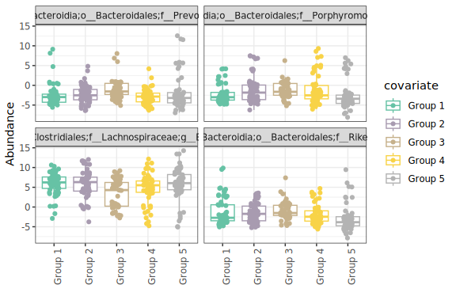
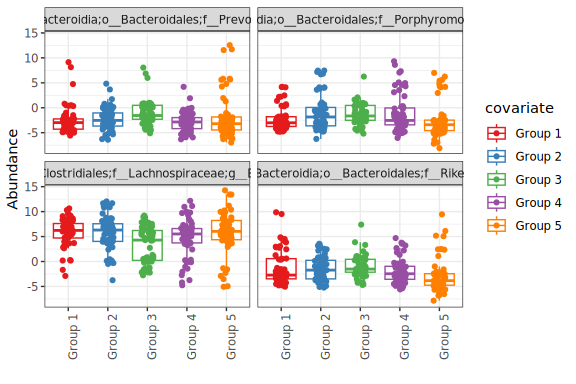

``` r
library(knitr)
library(OCMSutility)
#> Warning: replacing previous import 'dplyr::rename' by 'reshape::rename' when
#> loading 'OCMSutility'
#> Warning: replacing previous import 'reshape::expand' by 'tidyr::expand' when
#> loading 'OCMSutility'
library(ggplot2)
library(dplyr)
#> 
#> Attaching package: 'dplyr'
#> The following objects are masked from 'package:stats':
#> 
#>     filter, lag
#> The following objects are masked from 'package:base':
#> 
#>     intersect, setdiff, setequal, union
library(tibble)
```

# Overview

This package was created by members of the Oxford Centre for Microbiome
Studies (OCMS). It is a collection of functions that we have found
useful and hope that they are useful to others. The functions span data
manipulation, statistical analysis and data visualisation, predominantly
for microbiome data. Functions in this package and use cases are
documented below.

## example data

An example 16S dataset is included in the package. You can load this
with `data(asv_example)`

``` r
data(asv_example)

# 49 ASVs and 296 samples
dim(asv_example)
#> [1]  49 296

# 49 ASVs, with taxonomic levels in columns 
dim(tax_example)
#> [1] 49  7
colnames(tax_example)
#> [1] "sequence" "Phylum"   "Class"    "Order"    "Family"   "Genus"    "Species"
```

## filterFeature

Filters count table based on sequence abundance and prevalence. This
function returns several outputs that detail which features were
filtered out to help with quality control.

There are three methods by which sequences can be filtered. For all
three methods, the cut-off threshold is taken into consideration with
the prevalence of sequences across the samples\*. 1) ‘abs\_count’ refers
to read count.Sets the filter threshold at a specific read count, such
that a given sequence must be observed greater than or equal to the
cut-off count. 2) ‘percent\_sample’ refers to percent of sample total.
Looks at read counts as abundances relative to the sample total. This is
useful for when you want to keep features that make up at least x% in
your samples. 3) ‘percent\_dataset’ refers to percent of dataset total.
Looks at read counts as abundances relative to the dataset total. This
is useful for when you want to keep features that make up at least x% in
your dataset.

\*Sequence prevalence is calculated as the number of samples in which
sequence abundance is greater than or equal to the cut-off threshold.

Usage:

``` r
data(dss_example)

# put featureID as rownames
tax_df <- dss_example$merged_taxonomy
count_df <- dss_example$merged_abundance_id %>%
  column_to_rownames('featureID')
# set features in count tax to be in same order
count_df <- count_df[tax_df$featureID,]

filtered_ls <- filterFeature(count_df, tax_df, 'percent_sample', 0.001, 2)
#> Kept 303/734 (41.28%) features with read counts >= 0.001% with sample total read count in >= 2/25 (8%) samples
summary(filtered_ls)
#>             Length Class      Mode     
#> taxonomy      10   data.frame list     
#> filtered    7575   -none-     numeric  
#> p_agg          9   gg         list     
#> p_exp          9   gg         list     
#> feat_remove  431   -none-     character
#> feat_keep    303   -none-     character
#> msg            1   -none-     character
filtered_count <- filtered_ls$filtered
dim(filtered_count)
#> [1] 303  25
kable(head(filtered_count[,1:4]))
```

|        | 2DSS\_\_10 | 2DSS\_\_11 | 2DSS\_\_13 | 2DSS\_\_14 |
| :----- | ---------: | ---------: | ---------: | ---------: |
| ASV108 |  0.0005656 |  0.0012191 |  0.0000000 |  0.0000000 |
| ASV128 |  0.0018854 |  0.0000000 |  0.0051209 |  0.0000000 |
| ASV57  |  0.0066931 |  0.0000000 |  0.0000000 |  0.0000000 |
| ASV59  |  0.0004713 |  0.0010667 |  0.0011380 |  0.0000000 |
| ASV62  |  0.0005656 |  0.0740628 |  0.0008535 |  0.0005923 |
| ASV37  |  0.0029223 |  0.0000000 |  0.0000000 |  0.0000000 |

## relab

This is a convenience function for converting counts into relative
abundance (expressed as a % of reads).

Usage:

``` r
# get example data
data(asv_example)

# rownames have to be features
asv_counts <- data.frame(asv_example[2:ncol(asv_example)], row.names=asv_example$sequence)

rel_abundance <- relab(asv_counts)
```

## aggregateCount

Aggregates count on a given taxonomy level, providing an aggregated
count table and the corresponding taxonomy table. Both data frames are
returned in a list.

Notice that after aggregation, featureID is set to the taxonomy by which
aggregation was done, and all taxonomy levels below the aggregation
level are set to NA. The number of ASVs that were aggregated at each
taxon is recorded in the column `n_collapse`

Usage:

``` r
data(dss_example)
# featureID should be row names
feature_count <- dss_example$merged_abundance_id %>%
   tibble::column_to_rownames('featureID')

# cleanup sample names
colnames(feature_count) <- paste0('id', colnames(feature_count))
# taxonomy table must have columns 'Kingdom','Phylum',
# 'Class','Order','Family','Genus','Species'
# and feature IDs in rownames
feature_tax <- dss_example$merged_taxonomy

# set row order of count and tax tables to be the same
feature_count <- feature_count[feature_tax$featureID,]
aggregated_list <- aggregateCount(feature_count, feature_tax,
                                      aggregate_by = "Family")

summary(aggregated_list)
#>          Length Class      Mode
#> count_df 25     data.frame list
#> tax_df   11     data.frame list
knitr::kable(head(aggregated_list[['count_df']][,1:5]))
```

|                                | id2DSS\_\_10 | id2DSS\_\_11 | id2DSS\_\_13 | id2DSS\_\_14 | id2DSS\_\_16 |
| :----------------------------- | -----------: | -----------: | -----------: | -----------: | -----------: |
| Acidaminococcaceae             |           10 |            4 |            0 |            0 |            0 |
| Anaeroplasmataceae             |           60 |            0 |            7 |            0 |            0 |
| Bacteroidaceae                 |         1118 |         2921 |          262 |          256 |         1484 |
| Bifidobacteriaceae             |           12 |            0 |            0 |            0 |            0 |
| Burkholderiales incertae sedis |            0 |            0 |            0 |            9 |            5 |
| Clostridiaceae 1               |            0 |          428 |            0 |            0 |            0 |

``` r
knitr::kable(head(aggregated_list[['tax_df']]))
```

| featureID                      | sequence | Kingdom  | Phylum         | Class              | Order             | Family                         | Genus | Species | Taxon                                                                                                              | n\_collapse |
| :----------------------------- | :------- | :------- | :------------- | :----------------- | :---------------- | :----------------------------- | :---- | :------ | :----------------------------------------------------------------------------------------------------------------- | ----------: |
| Acidaminococcaceae             | NA       | Bacteria | Firmicutes     | Negativicutes      | Selenomonadales   | Acidaminococcaceae             | NA    | NA      | k\_\_Bacteria;p\_\_Firmicutes;c\_\_Negativicutes;o\_\_Selenomonadales;f\_\_Acidaminococcaceae                      |           4 |
| Anaeroplasmataceae             | NA       | Bacteria | Tenericutes    | Mollicutes         | Anaeroplasmatales | Anaeroplasmataceae             | NA    | NA      | k\_\_Bacteria;p\_\_Tenericutes;c\_\_Mollicutes;o\_\_Anaeroplasmatales;f\_\_Anaeroplasmataceae                      |           2 |
| Bacteroidaceae                 | NA       | Bacteria | Bacteroidetes  | Bacteroidia        | Bacteroidales     | Bacteroidaceae                 | NA    | NA      | k\_\_Bacteria;p\_\_Bacteroidetes;c\_\_Bacteroidia;o\_\_Bacteroidales;f\_\_Bacteroidaceae                           |          39 |
| Bifidobacteriaceae             | NA       | Bacteria | Actinobacteria | Actinobacteria     | Bifidobacteriales | Bifidobacteriaceae             | NA    | NA      | k\_\_Bacteria;p\_\_Actinobacteria;c\_\_Actinobacteria;o\_\_Bifidobacteriales;f\_\_Bifidobacteriaceae               |           3 |
| Burkholderiales incertae sedis | NA       | Bacteria | Proteobacteria | Betaproteobacteria | Burkholderiales   | Burkholderiales incertae sedis | NA    | NA      | k\_\_Bacteria;p\_\_Proteobacteria;c\_\_Betaproteobacteria;o\_\_Burkholderiales;f\_\_Burkholderiales incertae sedis |           1 |
| Clostridiaceae 1               | NA       | Bacteria | Firmicutes     | Clostridia         | Clostridiales     | Clostridiaceae 1               | NA    | NA      | k\_\_Bacteria;p\_\_Firmicutes;c\_\_Clostridia;o\_\_Clostridiales;f\_\_Clostridiaceae 1                             |           6 |

## reannotateTax

Reannotates taxonomy table so that “unclassfied” assignments include
higher level classifications. This helps preserve the biological meaning
of an unclassfied genus (as it could be classfied at the Family level).
The implications of this reannotation is illustrated using the following
example:

``` r
ex1 <- data.frame(ASV = paste0("ASV", 1:5),
                  Order = "order1",
                  Family = c(paste0("family", c(1,1,2,3)), 'unclassified'),
                  Genus = c("unclassified", 'genus1','unclassified','genus2',
                            "unclassified"),
                  read_count = 10)

knitr::kable(ex1)
```

| ASV  | Order  | Family       | Genus        | read\_count |
| :--- | :----- | :----------- | :----------- | ----------: |
| ASV1 | order1 | family1      | unclassified |          10 |
| ASV2 | order1 | family1      | genus1       |          10 |
| ASV3 | order1 | family2      | unclassified |          10 |
| ASV4 | order1 | family3      | genus2       |          10 |
| ASV5 | order1 | unclassified | unclassified |          10 |

Analysing the example above at the genus level would result in 3 groups:
Genus1 (count 10), Genus2 (10), Unclassified (30)

If you modify your classification at the genus level to include
information from higher taxonomic orders, you would get:

``` r
ex2 <- ex1[,c('ASV','Order')]
ex2$Family <- c(paste0("family", c(1,1,2,3)), 'order1_unclassified')
ex2$Genus <- c('family1_unclassified','genus1','family2_unclassified','genus2',
               'order1_unclassified')
ex2$read_count <- 10

knitr::kable(ex2)
```

| ASV  | Order  | Family               | Genus                 | read\_count |
| :--- | :----- | :------------------- | :-------------------- | ----------: |
| ASV1 | order1 | family1              | family1\_unclassified |          10 |
| ASV2 | order1 | family1              | genus1                |          10 |
| ASV3 | order1 | family2              | family2\_unclassified |          10 |
| ASV4 | order1 | family3              | genus2                |          10 |
| ASV5 | order1 | order1\_unclassified | order1\_unclassified  |          10 |

Analysing at the genus level now would result in 5 groups: Genus1 (10),
Genus2 (10), Family1\_Unclassified (10), Family2\_Unclassified (10),
Order1\_Unclassified (10).

Usage:

``` r
# showing the dummy example
old_tax <- ex1[,2:4]
old_tax$Kingdom <- 'kingdom1'
old_tax$Phylum <- 'phylum1'
old_tax$Class <- 'class1'
old_tax$Species <- 'unclassified'

old_tax <- old_tax[, c('Kingdom','Phylum','Class','Order','Family','Genus','Species')]
old_tax[old_tax == 'unclassified'] <- NA
knitr::kable(old_tax)
```

| Kingdom  | Phylum  | Class  | Order  | Family  | Genus  | Species |
| :------- | :------ | :----- | :----- | :------ | :----- | :------ |
| kingdom1 | phylum1 | class1 | order1 | family1 | NA     | NA      |
| kingdom1 | phylum1 | class1 | order1 | family1 | genus1 | NA      |
| kingdom1 | phylum1 | class1 | order1 | family2 | NA     | NA      |
| kingdom1 | phylum1 | class1 | order1 | family3 | genus2 | NA      |
| kingdom1 | phylum1 | class1 | order1 | NA      | NA     | NA      |

``` r

new_tax <- reannotateTax(old_tax)
knitr::kable(new_tax)
```

| Kingdom  | Phylum  | Class  | Order  | Family               | Genus                 | Species               |
| :------- | :------ | :----- | :----- | :------------------- | :-------------------- | :-------------------- |
| kingdom1 | phylum1 | class1 | order1 | family1              | family1\_unclassified | family1\_unclassified |
| kingdom1 | phylum1 | class1 | order1 | family1              | genus1                | genus1\_unclassified  |
| kingdom1 | phylum1 | class1 | order1 | family2              | family2\_unclassified | family2\_unclassified |
| kingdom1 | phylum1 | class1 | order1 | family3              | genus2                | genus2\_unclassified  |
| kingdom1 | phylum1 | class1 | order1 | order1\_unclassified | order1\_unclassified  | order1\_unclassified  |

``` r

# try with example data
data(asv_example)

# adding Kingdom column; removing sequence column because don't need asv IDs in this example
old_tax <- tax_example
colnames(old_tax)[1] <- 'Kingdom'
old_tax$Kingdom <- 'Bacteria'
knitr::kable(head(old_tax))
```

| Kingdom  | Phylum         | Class              | Order           | Family             | Genus            | Species                              |
| :------- | :------------- | :----------------- | :-------------- | :----------------- | :--------------- | :----------------------------------- |
| Bacteria | Firmicutes     | Negativicutes      | Selenomonadales | Acidaminococcaceae | Acidaminococcus  | Acidaminococcus\_intestini(AF473835) |
| Bacteria | Bacteroidetes  | Bacteroidia        | Bacteroidales   | Prevotellaceae     | Prevotella       | NA                                   |
| Bacteria | Firmicutes     | Negativicutes      | Selenomonadales | Veillonellaceae    | Dialister        | Dialister\_invisus(AY162469)         |
| Bacteria | Bacteroidetes  | Bacteroidia        | Bacteroidales   | Prevotellaceae     | Prevotella       | NA                                   |
| Bacteria | Proteobacteria | Betaproteobacteria | Burkholderiales | Sutterellaceae     | Sutterella       | NA                                   |
| Bacteria | Firmicutes     | Clostridia         | Clostridiales   | Lachnospiraceae    | Clostridium XlVa | NA                                   |

``` r

new_tax <- reannotateTax(old_tax)
knitr::kable(head(new_tax))
```

| Kingdom  | Phylum         | Class              | Order           | Family             | Genus            | Species                              |
| :------- | :------------- | :----------------- | :-------------- | :----------------- | :--------------- | :----------------------------------- |
| Bacteria | Firmicutes     | Negativicutes      | Selenomonadales | Acidaminococcaceae | Acidaminococcus  | Acidaminococcus\_intestini(AF473835) |
| Bacteria | Bacteroidetes  | Bacteroidia        | Bacteroidales   | Prevotellaceae     | Prevotella       | Prevotella\_unclassified             |
| Bacteria | Firmicutes     | Negativicutes      | Selenomonadales | Veillonellaceae    | Dialister        | Dialister\_invisus(AY162469)         |
| Bacteria | Bacteroidetes  | Bacteroidia        | Bacteroidales   | Prevotellaceae     | Prevotella       | Prevotella\_unclassified             |
| Bacteria | Proteobacteria | Betaproteobacteria | Burkholderiales | Sutterellaceae     | Sutterella       | Sutterella\_unclassified             |
| Bacteria | Firmicutes     | Clostridia         | Clostridiales   | Lachnospiraceae    | Clostridium XlVa | Clostridium XlVa\_unclassified       |

## plotPCoA

This is a simple PCoA function that colours all points by one metadata
variable. It can be helpful to visualise metadata variables
independently when assessing potential confounding metadtaa factors.

Usage:

``` r
data(dss_example)
met_df <- dss_example$metadata

count_df <- dss_example$merged_abundance_id %>%
  column_to_rownames('featureID')
count_df <- count_df[,met_df$sampleID]
relab <- relab(count_df)

iter_var <- c('Genotype','Phenotype')
plist <- list()
for(i in iter_var) {
  plist[[i]] <- plotPCoA(relab, met_df, colour = i)
}

plist[[1]]
```


``` r
plist[[2]]
```


## plotPCA

This function helps plot PCA score plots. It returns a list of the
original data, the PCA result and the ggplot. All dataframes are
returned in such a way that that ggplot produced can be modified with
additional geom layers.

Usage:

``` r
# get example data
data(asv_example)

# rownames have to be features
asv_counts <- data.frame(asv_example[2:ncol(asv_example)], row.names=asv_example$sequence)

asv_transformed <- clr(count_dataframe = asv_counts, return_as_dataframe = TRUE)
#> multicore environment is is OK -- using the BiocParallel package
#> computing center with all features

# generate some random metadata for the 295 samples - 5 time points with each individual
# having a data point at each time point
metadata <- data.frame(Timepoint = c(rep("Time 1", 59),
                                     rep("Time 2", 59),
                                     rep("Time 3", 59),
                                     rep("Time 4", 59),
                                     rep("Time 5", 59)),
                       Individual = as.character(c(rep(c(1:59), 5))),
                       row.names=colnames(asv_transformed),
                       stringsAsFactors = FALSE)
metadata$ID <- rownames(metadata)

pca_result <- prcomp(t(asv_transformed), scale = TRUE)
plot_data <- plotPCA(pca_result, metadata, colourby='Timepoint')

plot_data$p
```


``` r

# modify default plot
add_meta <- merge(plot_data$pdata, metadata, by = 'row.names' )
col_val <- getPalette(5, "Set3")
p <- plot_data$p +
  scale_colour_manual(values = col_val) + # pick own colours
  scale_shape_manual(values=21, guide = FALSE) + # change shape and remove from legend
  geom_text(data = add_meta, aes(x = PC1, y = PC2, label = ID)) # add text label
#> Scale for colour is already present.
#> Adding another scale for colour, which will replace the existing scale.
p
#> Warning: The `guide` argument in `scale_*()` cannot be `FALSE`. This was deprecated in ggplot2
#> 3.3.4.
#> i Please use "none" instead.
#> i The deprecated feature was likely used in the OCMSutility package.
#>   Please report the issue to the authors.
#> This warning is displayed once every 8 hours.
#> Call `lifecycle::last_lifecycle_warnings()` to see where this warning was generated.
```


## getPalette

This is a convenience function for getting a set of colours for plotting
purposes. Setting preview=TRUE will show you the colours. The colours
can be changed by adding a palette(s) to the palette
    argument.

Usage:

``` r
getPalette(n=10, palette="Set3", preview=TRUE)
```


    #>  [1] "#8DD3C7" "#FFFFB3" "#BEBADA" "#FB8072" "#80B1D3" "#FDB462" "#B3DE69"
    #>  [8] "#FCCDE5" "#D9D9D9" "#BC80BD"

## clr

clr uses the
[ALDEx2](https://www.bioconductor.org/packages/release/bioc/html/ALDEx2.html)
package to perform centred log-ratio transformation on a count matrix
from for example 16S rRNA profiling.

Usage:

``` r
# rownames have to be features
asv_counts <- data.frame(asv_example[2:ncol(asv_example)], row.names=asv_example$sequence)

clr_transformed <- clr(count_dataframe = asv_counts, return_as_dataframe = TRUE)
#> multicore environment is is OK -- using the BiocParallel package
#> computing center with all features

# returns data frame with transformed abundance estamtes with imputed zeroes
class(clr_transformed)
#> [1] "data.frame"
dim(clr_transformed)
#> [1]  49 295
```

This will return a data frame with transformed abundance estimates (most
common use case). It is also possible to return the ALDEx2 object
instead.

``` r
clr_transformed <- clr(count_dataframe = asv_counts, return_as_dataframe = FALSE)
#> multicore environment is is OK -- using the BiocParallel package
#> computing center with all features

# returns ALDEx2 object
class(clr_transformed)
#> [1] "aldex.clr"
#> attr(,"package")
#> [1] "ALDEx2"
```

## featurebox

This function takes a matrix of abudnances from RNA-seq or microbiome
data along with a metadata dataframe and produces a boxplot for a
feature(s) of interest. The main use for this function is to plot
abundance estimates grouping by variable of interest.

Usage:

``` r
# get example data
data(asv_example)

# rownames have to be features
asv_counts <- data.frame(asv_example[2:ncol(asv_example)], row.names=asv_example$sequence)

# for plotting purposes we would transform the data e.g. clr
asv_clr <- clr(asv_counts)
#> multicore environment is is OK -- using the BiocParallel package
#> computing center with all features

# generate some random metadata for the 295 samples - 5 groups for example
metadata <- data.frame(Group = c(rep("Group 1", 59),
                                 rep("Group 2", 59),
                                 rep("Group 3", 59),
                                 rep("Group 4", 59),
                                 rep("Group 5", 59)),
                                 row.names=colnames(asv_clr))

# produce boxplot of random 4 features as an example grouping by Group variable
features <- sample(rownames(asv_clr), size=4)
featurebox(abundance_matrix=asv_clr, metadata=metadata, features=features, group_by="Group")
#> Using feature as id variables
#> Warning: Use of `mat.m$covariate` is discouraged.
#> i Use `covariate` instead.
#> Use of `mat.m$covariate` is discouraged.
#> i Use `covariate` instead.
```



The default palettes used are “Set2”, “Set3” and “Set4”, and the result
will depend on the number of colours you need. You can change the
colours if you like by adding manual
scale:

``` r
featurebox(abundance_matrix=asv_clr, metadata=metadata, features=features, group_by="Group") +
  scale_colour_manual(values=getPalette(n=5, palette="Set1"))
#> Using feature as id variables
#> Scale for colour is already present.
#> Adding another scale for colour, which will replace the existing scale.
#> Warning: Use of `mat.m$covariate` is discouraged.
#> i Use `covariate` instead.
#> Use of `mat.m$covariate` is discouraged.
#> i Use `covariate` instead.
```



## dissimilarity

The purpose of this function is to determine dissimilarity between
samples using Bray-Curtis dissimilarity. This is typically done if you
want to compare dissimilarity between groups or compare
within-individual dissimilarity with between-individual similarity where
you have multiple samples per individual. The function takes a relative
abundance matrix and relevant metadata as input and outputs a data frame
with Bray-Curtis dissimilarity measure that can be plotted. Below is an
example where this may be of use.

Usage:

``` r
# get example data
data(asv_example)

# rownames have to be features
asv_counts <- data.frame(asv_example[2:ncol(asv_example)], row.names=asv_example$sequence)

asv_relab <- relab(asv_counts)

# generate some random metadata for the 295 samples - 5 time points with each individual
# having a data point at each time point
metadata <- data.frame(Timepoint = c(rep("Time 1", 59),
                                     rep("Time 2", 59),
                                     rep("Time 3", 59),
                                     rep("Time 4", 59),
                                     rep("Time 5", 59)),
                       Individual = as.character(c(rep(c(1:59), 5))),
                       row.names=colnames(asv_relab),
                       stringsAsFactors = FALSE)

# remove samples with NA
asv_relab <- asv_relab[,!(is.na(colSums(asv_relab)))]

# make sure they are the same
metadata <- metadata[colnames(asv_relab),]

# ask the question - Are individuals more similar to each other than samples are within timepoints?

# within-individual dissimilarity
within_diss <- dissimilarity(asv_relab, metadata=metadata, individual_variable = "Individual", method="within")

knitr::kable(head(within_diss))
```

| dissimilarity | method            |
| ------------: | :---------------- |
|     0.7080197 | Within-individual |
|     0.8067290 | Within-individual |
|     0.8098117 | Within-individual |
|     0.8455110 | Within-individual |
|     0.5200789 | Within-individual |
|     0.9769913 | Within-individual |

``` r

# between-individual dissimilarity at timpoint 1
metadata_t1 <- metadata[metadata$Timepoint == "Time 1",]
asv_relab_t1 <- asv_relab[,rownames(metadata_t1)]
between_diss <- dissimilarity(asv_relab_t1, metadata=metadata_t1, method="between")
#> using method=between, make sure there is only one sample per individual

knitr::kable(head(between_diss))
```

| dissimilarity | method             |
| ------------: | :----------------- |
|     0.8130555 | Between-individual |
|     0.8108123 | Between-individual |
|     0.8153680 | Between-individual |
|     0.8027017 | Between-individual |
|     0.9662146 | Between-individual |
|     0.8061727 | Between-individual |

``` r

# we can then combine and plot them
diss <- bind_rows(within_diss, between_diss)
ggplot(diss, aes(x=method, y=dissimilarity)) +
  geom_violin() +
  xlab("Dissimilarity type") +
  ylab("Bray-Curtis dissimilarity") +
  theme_bw()
```


## rarefaction

Useful for calculating and plotting rarefaction curve to check if read
depth captures as much diversity as possible.

``` r
# get example data
data(asv_example)

# rownames have to be features
asv_counts <- data.frame(asv_example[2:ncol(asv_example)], row.names=asv_example$sequence)

rarefaction <- rarefaction(asv_counts)
#> Warning: executing %dopar% sequentially: no parallel backend registered
#> Warning in max(x, na.rm = T): no non-missing arguments to max; returning -Inf

#> Warning in max(x, na.rm = T): no non-missing arguments to max; returning -Inf

#> Warning in max(x, na.rm = T): no non-missing arguments to max; returning -Inf

#> Warning in max(x, na.rm = T): no non-missing arguments to max; returning -Inf

#> Warning in max(x, na.rm = T): no non-missing arguments to max; returning -Inf

#> Warning in max(x, na.rm = T): no non-missing arguments to max; returning -Inf

#> Warning in max(x, na.rm = T): no non-missing arguments to max; returning -Inf

#> Warning in max(x, na.rm = T): no non-missing arguments to max; returning -Inf

#> Warning in max(x, na.rm = T): no non-missing arguments to max; returning -Inf

#> Warning in max(x, na.rm = T): no non-missing arguments to max; returning -Inf

#> Warning in max(x, na.rm = T): no non-missing arguments to max; returning -Inf

#> Warning in max(x, na.rm = T): no non-missing arguments to max; returning -Inf

#> Warning in max(x, na.rm = T): no non-missing arguments to max; returning -Inf

#> Warning in max(x, na.rm = T): no non-missing arguments to max; returning -Inf
#> Warning: The `<scale>` argument of `guides()` cannot be `FALSE`. Use "none" instead as of ggplot2
#> 3.3.4.
#> i The deprecated feature was likely used in the OCMSutility package.
#>   Please report the issue to the authors.
#> This warning is displayed once every 8 hours.
#> Call `lifecycle::last_lifecycle_warnings()` to see where this warning was generated.

# default plot
p <- rarefaction$rare_p
p
#> Warning: ggrepel: 271 unlabeled data points (too many overlaps). Consider
#> increasing max.overlaps
```


``` r

# modify default plot -- remove geom_label_repel layer
p$layers[[2]] <- NULL
p
```


## plotSunburst

Creates interactive sunburst plot based on taxonomy. The sunburst plot
can show areas based on relative abundance or based on the number of
taxa at a given taxonomic level.

You specify a palette for each Phylum, where values are the colour
palette to use and name is the corresponding phylum
(e.g.`c('Bacteroidetes' = 'Oranges', 'Firmicutes' = 'Greens')`).
Palettes should be from
[rColorBrewer](https://www.r-graph-gallery.com/38-rcolorbrewers-palettes.html).
If the number of palettes specified doesn’t include all phyla in the tax
table, only the specified ones will be coloured and the rest will be in
grey. If palettes is set to NULL, the default colours selected by
`sunbrustR` will be used.

Additionally the `highlight` parameter can be used to highlight a
specific taxon at any taxonomic level and the ones that are not
specified will be coloured as grey.
e.g. `list("Family"=c("Enterococcaceae","Ruminacoccaceae")`. This is
applied after palettes is used to colour by phylum if palettes argument
is specified so you can use the `palettes` argument to choose your
colour and all taxa not specified by `hightlight` are set to grey.

Note: NAs in the taxonomy table cause colouring to be assigned in
unexpected order so it is best to use `reannotateTax` to apply a
taxonomy roll-down and remove all NAs.
[sunburstR](https://github.com/timelyportfolio/sunburstR) uses hyphens
(`-`) to distinguish taxonomic levels so any hyphens in the taxonomy
name will be interpreted as two separate levels. Therefore, all hyphens
are silently and automatically removed from taxonomy names

``` r
data("dss_example")
# set count feature ids as rownames
count_df <- dss_example$merged_abundance_id %>%
  column_to_rownames('featureID')

# clean up some sample names
colnames(count_df) <- paste0('id', colnames(count_df))
tax_df <- dss_example$merged_taxonomy

# aggregate counts
agg_gen <- aggregateCount(count_df[tax_df$featureID,], tax_df, "Genus")
count_genus <- agg_gen$count_df

# reannotate taxonomy
tax_genus <- reannotateTax(agg_gen$tax_df)

relab <- relab(count_genus)

# color specific phyla
# plotSunburst(relab = NULL, tax = tax_genus,  
#              palettes = c("Proteobacteria" = "Oranges",
#                           "Bacteroidetes" = "Greens"))
# color specific phyla taking into account of relative abundance
# plotSunburst(relab = relab, tax = tax_genus,  
#              palettes = c("Proteobacteria" = "Oranges", "Bacteroidetes" = "Greens"))

# highlight specific genera
# plotSunburst(relab = relab, tax = tax_genus, 
#              palettes = c("Bacteroidetes" = "Greens",'Firmicutes'='Blues'), 
#              highlight = list("Genus" = c("Bacteroides",'Clostridium XlVa')))
```

## convert\_platemap

This function converts excel plate map to long data frame with map
locations. It uses [readxl](https://readxl.tidyverse.org) to read in
excel file.

Usage: You supply the function with the excel file and specify the sheet
name (if applicable) and the cell range that contains your plate map.
`convert_platemap` then converts the platemap into a long data frame.
The `drop_empty` function allows your to drop unlabeled wells.

``` r
plate_map <- convert_platemap(map_file = "my96wellplate.xlsx",
                              map_range = 'A1:H12') 
```

    #>    well_id col row   sample_name
    #> 1       A1   1   A  sample_name1
    #> 2       A2   2   A  sample_name2
    #> 3       A3   3   A  sample_name3
    #> 4       A4   4   A  sample_name4
    #> 5       A5   5   A  sample_name5
    #> 6       A6   6   A  sample_name6
    #> 7       A7   7   A  sample_name7
    #> 8       A8   8   A  sample_name8
    #> 9       A9   9   A  sample_name9
    #> 10     A10  10   A sample_name10
    #> 11     A11  11   A sample_name11
    #> 12     A12  12   A sample_name12
    #> 13      B1   1   B sample_name13
    #> 14      B2   2   B sample_name14
    #> 15      B3   3   B sample_name15
    #> 16      B4   4   B sample_name16
    #> 17      B5   5   B sample_name17
    #> 18      B6   6   B sample_name18
    #> 19      B7   7   B sample_name19
    #> 20      B8   8   B sample_name20
    #> 21      B9   9   B sample_name21
    #> 22     B10  10   B sample_name22
    #> 23     B11  11   B sample_name23
    #> 24     B12  12   B sample_name24
    #> 25      C1   1   C sample_name25
    #> 26      C2   2   C sample_name26
    #> 27      C3   3   C sample_name27
    #> 28      C4   4   C sample_name28
    #> 29      C5   5   C sample_name29
    #> 30      C6   6   C sample_name30
    #> 31      C7   7   C sample_name31
    #> 32      C8   8   C sample_name32
    #> 33      C9   9   C sample_name33
    #> 34     C10  10   C sample_name34
    #> 35     C11  11   C sample_name35
    #> 36     C12  12   C sample_name36
    #> 37      D1   1   D sample_name37
    #> 38      D2   2   D sample_name38
    #> 39      D3   3   D sample_name39
    #> 40      D4   4   D sample_name40
    #> 41      D5   5   D sample_name41
    #> 42      D6   6   D sample_name42
    #> 43      D7   7   D sample_name43
    #> 44      D8   8   D sample_name44
    #> 45      D9   9   D sample_name45
    #> 46     D10  10   D sample_name46
    #> 47     D11  11   D sample_name47
    #> 48     D12  12   D sample_name48
    #> 49      E1   1   E sample_name49
    #> 50      E2   2   E sample_name50
    #> 51      E3   3   E sample_name51
    #> 52      E4   4   E sample_name52
    #> 53      E5   5   E sample_name53
    #> 54      E6   6   E sample_name54
    #> 55      E7   7   E sample_name55
    #> 56      E8   8   E sample_name56
    #> 57      E9   9   E sample_name57
    #> 58     E10  10   E sample_name58
    #> 59     E11  11   E sample_name59
    #> 60     E12  12   E sample_name60
    #> 61      F1   1   F sample_name61
    #> 62      F2   2   F sample_name62
    #> 63      F3   3   F sample_name63
    #> 64      F4   4   F sample_name64
    #> 65      F5   5   F sample_name65
    #> 66      F6   6   F sample_name66
    #> 67      F7   7   F sample_name67
    #> 68      F8   8   F sample_name68
    #> 69      F9   9   F sample_name69
    #> 70     F10  10   F sample_name70
    #> 71     F11  11   F sample_name71
    #> 72     F12  12   F sample_name72
    #> 73      G1   1   G sample_name73
    #> 74      G2   2   G sample_name74
    #> 75      G3   3   G sample_name75
    #> 76      G4   4   G sample_name76
    #> 77      G5   5   G sample_name77
    #> 78      G6   6   G sample_name78
    #> 79      G7   7   G sample_name79
    #> 80      G8   8   G sample_name80
    #> 81      G9   9   G sample_name81
    #> 82     G10  10   G sample_name82
    #> 83     G11  11   G sample_name83
    #> 84     G12  12   G sample_name84
    #> 85      H1   1   H sample_name85
    #> 86      H2   2   H sample_name86
    #> 87      H3   3   H sample_name87
    #> 88      H4   4   H sample_name88
    #> 89      H5   5   H sample_name89
    #> 90      H6   6   H sample_name90
    #> 91      H7   7   H sample_name91
    #> 92      H8   8   H sample_name92
    #> 93      H9   9   H sample_name93
    #> 94     H10  10   H sample_name94
    #> 95     H11  11   H sample_name95
    #> 96     H12  12   H sample_name96

## truePosRate

Calculate rate of true positives in positive control standards. Used in
OCMS\_zymobioimcs
report.

Usage:

``` r
# this would be better exemplified with actual std data rather than the example samples
data("dss_example")
data(zymobiomics)

# set count feature ids as rownames
count_df <- dss_example$merged_abundance_id %>%
  column_to_rownames('featureID')

# clean up some sample names
colnames(count_df) <- paste0('id', colnames(count_df))
tax_df <- dss_example$merged_taxonomy

# aggregate counts
agg_gen <- aggregateCount(count_df[tax_df$featureID,], tax_df, "Genus")
genus_relab <- relab(agg_gen$count_df)

true_pos_result <- truePosRate(relab=genus_relab,
                                    annotations=zymobiomics$anno_ncbi_16s,
                                    level='genus', cutoff=0.01)

# plot true pos rate
p <- ggplot(true_pos_result,
            aes(x=rank, y=true.pos.rate, colour=label, group=sample)) +
  geom_point() +
  theme_bw() +
  ylab("TP / (TP + FP)") +
  scale_colour_manual(values=c("grey", "purple")) +
  facet_wrap(~sample, scale="free")

p
```


## metfile\_init

This helper function initiates a metadata table that is compatible with
`OCMSlooksy`.

Usage: This function takes the database file returned from [`ocms_16s
dada2_pipeline build_db`](https://ocms-16s.readthedocs.io/en/latest/).

`db_file` is the rsqlite database file `out_dir` output directory.
default `NULL` so no output file written. `ref_table` name of table in
the database from which `sampleID` is generated. defaults NULL which
uses `merged_abundance_id` (the count table) to get sampleID `id_orient`
indicates orientation of sampleID in `ref_table` in rows or in columns.
options are `row` or `col` `dummy` allows you to make a dummy column of
NAs

``` r
db_file <- "/path/to/db/file"
met <- metfile_init(db_file, dummy = "Group")
```

## metadata\_sparsity

This function checks your metadata for the number of missing values in
each sample. This function can be used to check how sparse the metadata
is. In human studies, it is easy to have sparse metadata which
inadvertently gives subsets of samples simply based on the amount of
available information. This function tallies the number of NA in each
sample and returns subsets of samples based on the number of missing
values they have.

Usage:

Takes in a dataframe where samples are in rows and metadata variables
are in columns. The function returns a list where the first item in the
list `na_tally` shows the number of samples with a given number of
missing values.

``` r
set.seed(1)
# setting up example metadata dataframe
 metadata_example <- data.frame(
   sampleID = LETTERS[1:10],
   group = c(rep(1:2, each = 3), rep(3, 4)),
   age = c(rnorm(6, 30, 5), rep(NA, 4)),
   sex = c(rep('F', 3), rep(NA, 4), rep('M', 3)),
   ethnicity = sample(c(NA,1,2,3), 10, replace = TRUE),
   medication = sample(c(NA,1,2), 10, replace=TRUE))

met_sparse <- metadata_sparsity(metadata_example)

summary(met_sparse)
#>          Length Class      Mode
#> na_tally 2      data.frame list
#>          6      data.frame list
#>          6      data.frame list
#>          6      data.frame list
met_sparse$na_tally
#>   n_na Freq
#> 1    1    3
#> 2    2    6
#> 3    3    1
met_sparse[[3]]
#>   sampleID group      age  sex ethnicity medication
#> 1        A     1 26.86773    F        NA         NA
#> 2        B     1 30.91822    F        NA         NA
#> 3        C     1 25.82186    F        NA         NA
#> 4        D     2 37.97640 <NA>         1         NA
#> 6        F     2 25.89766 <NA>         1         NA
#> 9        I     3       NA    M        NA          1
met_sparse[[4]]
#>   sampleID group age  sex ethnicity medication
#> 7        G     3  NA <NA>         1         NA
```

## pca\_by\_var

This function overlays numeric metadata variables onto a PCA score plot,
which can be useful during exploratory analysis where you want to see
how different metadata variables map onto a PCA plot. This function
produces a named list of plots, where the first plot is the score/biplot
and subsequent plots are the same PCA plot but colour coded by a given
metadata variable. Metadata variables can be numeric, character, or
factors.

``` r
set.seed(1)
data(dss_example)

# samples in rows
ddata <- dss_example$merged_abundance_id[,2:26]
rownames(ddata) <- dss_example$merged_abundance_id[,1]
ddata <- as.data.frame(t(ddata))
mdata <- dss_example$metadata
mdata <- mdata[match(rownames(ddata), mdata$sampleID),]

# creating some dummy metadata variable
mdata$var1 <- rep(rnorm(5, 25, 3), each=5)
mdata$var2 <- rep(rnorm(5, 3, 0.5), 5)
mdata$var3 <- as.factor(rep(letters[1:5], each=5))
mdata <- mdata[,c('Phenotype','var1','var2','var3')]
p_list <- pca_by_var(ddata, mdata)

# biplot
p_list$main_pca
```


``` r

# pca with metadata variables overlayed
p_list$Phenotype
```


``` r
p_list$var1
```


``` r
p_list$var2
```


``` r
p_list$var3
```


``` r

# can use cowplot::plot_grid to put all plots into one
cowplot::plot_grid(plotlist=list(p_list$Phenotype, p_list$var1, p_list$var2, p_list$var3))
```


## nsample\_by\_var

This function counts the number of samples for each individual for a
given metadata variable. This is useful in time course data when you
want to check how complete the metadata variables are. This is
complementary to `metadata_sparsity`, which tells you which gives
information on missing values, while `nsample_by_var` gives information
on the available metadata.

Usage:

Takes in a dataframe where samples are in rows and metadata variables
are in columns. Providing the identifier column and the metadata
variables to tally, the function returns a tally of the number of non-NA
samples for each identifier for a given metadata variable.

In the example below, we have 25 patients, each with 4 time point
samples, and three metadata variables.

``` r
df <- data.frame(sample_id = paste0("sample", 1:100),
                patient_id = rep(LETTERS[1:25], 4),
                var1 = sample(c(rnorm(30, 10, 0.5), rnorm(40, 25, 2),
                                rep(NA, 30)), 100),
                var2 = sample(c(rnorm(65, 0.5, 0.01),
                                rep(0, 20),
rep(NA, 15)), 100),
                var3 = sample(c(letters[1:5], NA), 100, replace=TRUE))

nsample_by_var(df, 'patient_id', c('var1','var2','var3'))
#>    patient_id var1 var2 var3
#> 1           A    4    4    3
#> 2           B    4    4    4
#> 3           C    4    3    4
#> 4           D    4    2    1
#> 5           E    2    2    3
#> 6           F    1    4    3
#> 7           G    3    3    4
#> 8           H    3    4    4
#> 9           I    2    4    4
#> 10          J    3    4    4
#> 11          K    2    4    3
#> 12          L    2    4    2
#> 13          M    4    3    2
#> 14          N    2    4    3
#> 15          O    3    3    4
#> 16          P    4    3    4
#> 17          Q    1    4    3
#> 18          R    3    3    3
#> 19          S    2    4    3
#> 20          T    3    4    4
#> 21          U    4    3    1
#> 22          V    4    2    4
#> 23          W    0    4    4
#> 24          X    2    3    4
#> 25          Y    4    3    3
```

## sym\_mat2df

Converts symmetrical matrix to long dataframe, with columns `x`, `y`,
`value`. Helpful for correlation or distance matrices

Usage:

``` r
# load example data
data(dss_example)

# subset features, features in columns
feat_mat <- dss_example$merged_abundance_id[1:6,2:26]
rownames(feat_mat) <- dss_example$merged_abundance_id[1:6,1]
feat_mat <- t(feat_mat)

# correlation matrix
corr_result <- cor(feat_mat)
sym_mat2df(corr_result)
#>      X1   X2        value
#> 1  ASV1 ASV2  0.328933077
#> 2  ASV1 ASV3  0.458898743
#> 3  ASV1 ASV4  0.273324036
#> 4  ASV1 ASV5  0.770830067
#> 5  ASV1 ASV6  0.577547045
#> 6  ASV2 ASV3  0.162107933
#> 7  ASV2 ASV4 -0.002684052
#> 8  ASV2 ASV5  0.384139309
#> 9  ASV2 ASV6  0.318054017
#> 10 ASV3 ASV4  0.102121821
#> 11 ASV3 ASV5  0.700666100
#> 12 ASV3 ASV6  0.834738679
#> 13 ASV4 ASV5  0.315981925
#> 14 ASV4 ASV6  0.121482740
#> 15 ASV5 ASV6  0.749430510
```

## adjust\_mat\_pval

Adjust matrix of p-values for multiple correction and returns the
adjusted p-values as symmertrical matrix or as long dataframe. Helpful
for correlation matrices.

Usage:

``` r
# load example data
data(dss_example)

# subset features, features in columns
feat_mat <- dss_example$merged_abundance_id[1:6,2:26]
rownames(feat_mat) <- dss_example$merged_abundance_id[1:6,1]
feat_mat <- t(feat_mat)

# correlation matrix
corr_result <- psych::corr.test(feat_mat)
adjust_mat_pval(corr_result$p)
#>              ASV1 ASV2         ASV3 ASV4         ASV5         ASV6
#> ASV1 1.0000000000    1 5.257982e-01    1 0.0006842817 8.253906e-02
#> ASV2 1.0000000000    1 1.000000e+00    1 1.0000000000 1.000000e+00
#> ASV3 0.5257981878    1 1.000000e+00    1 0.0043193475 4.783898e-05
#> ASV4 1.0000000000    1 1.000000e+00    1 1.0000000000 1.000000e+00
#> ASV5 0.0006842817    1 4.319347e-03    1 1.0000000000 1.053959e-03
#> ASV6 0.0825390647    1 4.783898e-05    1 0.0010539587 1.000000e+00
adjust_mat_pval(corr_result$p, out_type='dataframe')
#>      X1   X2      padjust
#> 1  ASV1 ASV2 1.000000e+00
#> 2  ASV1 ASV3 5.257982e-01
#> 3  ASV1 ASV4 1.000000e+00
#> 4  ASV1 ASV5 6.842817e-04
#> 5  ASV1 ASV6 8.253906e-02
#> 6  ASV2 ASV3 1.000000e+00
#> 7  ASV2 ASV4 1.000000e+00
#> 8  ASV2 ASV5 1.000000e+00
#> 9  ASV2 ASV6 1.000000e+00
#> 10 ASV3 ASV4 1.000000e+00
#> 11 ASV3 ASV5 4.319347e-03
#> 12 ASV3 ASV6 4.783898e-05
#> 13 ASV4 ASV5 1.000000e+00
#> 14 ASV4 ASV6 1.000000e+00
#> 15 ASV5 ASV6 1.053959e-03
```

## compare\_cor\_ci

Performs pairwise correlations of features with adjusted p-values.
Correlations and confidence intervals calculated for each sample group.

Usage:

``` r
# load example data
data(dss_example)

# subset features, features in columns
feat_mat <- dss_example$merged_abundance_id[1:6,2:26]
rownames(feat_mat) <- dss_example$merged_abundance_id[1:6,1]
feat_mat <- t(feat_mat)

# metadata in same order
met_df <- dss_example$metadata
met_df <- met_df[match(rownames(feat_mat), met_df$sampleID),]
compare_cor_ci(feat_mat, met_df$Phenotype)
#> Warning in cor(x, use = use, method = method): the standard deviation is zero
#>       x    y group  n           r          p     p.adj    lower_ci  upper_ci
#> 1  ASV1 ASV2   DSS 13          NA         NA        NA          NA        NA
#> 2  ASV1 ASV3   DSS 13 -0.17292227 0.57211293 0.8796790 -0.66093523 0.4178774
#> 3  ASV1 ASV4   DSS 13 -0.34430158 0.94229442 0.7479965 -0.75252840 0.2550722
#> 4  ASV1 ASV5   DSS 13 -0.02232353         NA 0.9422944 -0.56634285 0.5352453
#> 5  ASV1 ASV6   DSS 13          NA 0.58645268        NA          NA        NA
#> 6  ASV2 ASV3   DSS 13          NA 0.24933216        NA          NA        NA
#> 7  ASV2 ASV4   DSS 13          NA         NA        NA          NA        NA
#> 8  ASV2 ASV5   DSS 13          NA         NA        NA          NA        NA
#> 9  ASV2 ASV6   DSS 13          NA         NA        NA          NA        NA
#> 10 ASV3 ASV4   DSS 13  0.49936118         NA 0.4939076 -0.07121951 0.8237103
#> 11 ASV3 ASV5   DSS 13  0.16659937         NA 0.8796790 -0.42323641 0.6572529
#> 12 ASV3 ASV6   DSS 13          NA 0.81852228        NA          NA        NA
#> 13 ASV4 ASV5   DSS 13 -0.07067946 0.08231793 0.9422944 -0.59836252 0.4997685
#> 14 ASV4 ASV6   DSS 13          NA         NA        NA          NA        NA
#> 15 ASV5 ASV6   DSS 13          NA         NA        NA          NA        NA
#> 16 ASV1 ASV2 water 12  0.18564204 0.56349873 0.8193311 -0.43455744 0.6864130
#> 17 ASV1 ASV3 water 12  0.08650613 0.78922369 0.8455968 -0.51285678 0.6291719
#> 18 ASV1 ASV4 water 12  0.13702012 0.03866202 0.8193311 -0.47416823 0.6590932
#> 19 ASV1 ASV5 water 12  0.60121866 0.69985094 0.2899652  0.04170797 0.8736692
#> 20 ASV1 ASV6 water 12  0.12008510 0.14872901 0.8193311 -0.48740718 0.6492428
#> 21 ASV2 ASV3 water 12 -0.04731533 0.67110167 0.8839068 -0.60479416 0.5412845
#> 22 ASV2 ASV4 water 12 -0.12450292 0.71008691 0.8193311 -0.65182972 0.4839803
#> 23 ASV2 ASV5 water 12  0.25704233 0.41994958 0.8193311 -0.37168987 0.7241234
#> 24 ASV2 ASV6 water 12  0.12330163 0.01030401 0.8193311 -0.48491396 0.6511275
#> 25 ASV3 ASV4 water 12 -0.18837193 0.88390679 0.8193311 -0.68790611 0.4322600
#> 26 ASV3 ASV5 water 12  0.44347367 0.70262984 0.7436451 -0.17495605 0.8109741
#> 27 ASV3 ASV6 water 12  0.70591564 0.54824959 0.1545601  0.22191935 0.9108202
#> 28 ASV4 ASV5 water 12  0.19281163 0.55767227 0.8193311 -0.42850631 0.6903254
#> 29 ASV4 ASV6 water 12 -0.29445657 0.35286181 0.8193311 -0.74282830 0.3362712
#> 30 ASV5 ASV6 water 12  0.36129770 0.24854130 0.8193311 -0.26821893 0.7745888
```
